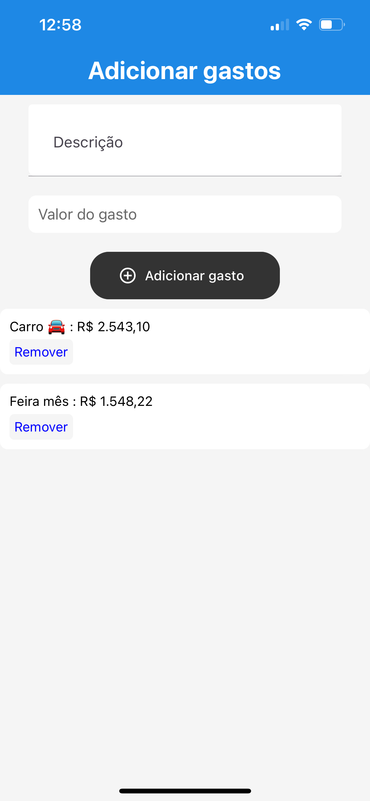

# Wallet

Wallet é um aplicativo de gerenciamento de finanças pessoais simples e eficaz, desenvolvido com React Native. O aplicativo permite que você adicione, visualize e gerencie seu saldo e suas despesas de forma prática.

## Funcionalidades

- **Adicionar saldo**: Adicione saldo inicial à sua carteira, ou atualize o saldo atual.
- **Adicionar despesas**: Insira e categorize suas despesas com descrição e valor.
- **Verificar média de Gastos**: O aplicativo calcula automaticamente a média de seus gastos.
- **Limpar carteira**: Resete o saldo e remova todas as transações.
- **Persistência de dados**: As transações e o saldo são armazenados localmente utilizando `AsyncStorage` para garantir que os dados sejam mantidos ao fechar o aplicativo.

## Screenshots

<div align="center">
  
  
  
</div>

## Tecnologias utilizadas

- **React Native**: Biblioteca principal para a criação de interfaces nativas.
- **React Navigation**: Gerenciamento de navegação entre telas.
- **AsyncStorage**: Armazenamento local de dados para persistência.
- **react-native-paper**: Biblioteca para componentes de interface do usuário com suporte a tema e acessibilidade.
- **react-native-currency-input**: Entrada de dados de valores monetários com formatação automática.
- **Expo**: Plataforma usada para construir, distribuir e testar o aplicativo.

## Instalação

1. Clone o repositório:

    ```bash
    git clone https://github.com/seuusuario/wallet2.git
    ```

2. Instale as dependências:

    ```bash
    cd wallet2
    npm install
    ```

3. Execute o aplicativo:

    ```bash
    expo start
    ```

## Gerando APK ou AAB

Para gerar um APK ou AAB para Android, siga os passos abaixo:

1. Execute o comando para compilar o projeto:

    ```bash
    eas build -p android --profile production
    ```

2. Para gerar um arquivo `.apk`, ajuste o arquivo `eas.json` com o seguinte:

    ```json
    {
      "build": {
        "production": {
          "android": {
            "buildType": "apk"
          }
        }
      }
    }
    ```

## Atualização do aplicativo no Expo

Para atualizar o aplicativo no Expo sem precisar criar uma nova versão, execute o comando:

```bash
eas update
```

Certifique-se de que o projeto esteja devidamente configurado no Expo para receber atualizações over-the-air (OTA).

## Contribuição

Se você deseja contribuir com o projeto, sinta-se à vontade para enviar um pull request ou abrir uma issue.
